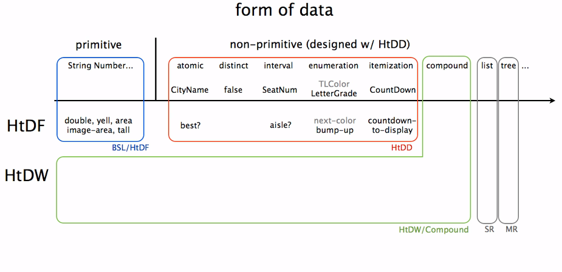

# Summary of Module 2: Cond, Data Design

[TOC]

## 0. Questions
- Write cond, go through evaluation rules
-
```java
(define (mag2 x)
  (cond [(< x 0) "negative"]
        [(= x 0) "zero"]
        [else    "positive"]))

(mag2 0)

```
## 1. Cond Statement
### Syntax rules:

```lisp
(cond Q-A pairs in [] or ())


(define (aspect-ratio img)
  (cond [(> (image-height img) (image-width img)) "tall"]
        [(= (image-height img) (image-width img)) "square"]
        [else "wide"]))
```
by convention use __[]__
__Q-A pair__: Q - predicate, except for last one that can be "else"

### Evaluation rules for Cond expressions:
- No Q-A pairs -> error
- if the first Q is not a value, evaluate and replace entire cond with the new cond in which the first Q is replaced with its value
- if the first Q is true/else, replace cond expression with the first A
- If the first Q is false, drop 1st Q-A pair: replace cond with first pair removed
- Since 1st Q is not else/true/false, raise error

## 2. Data Design Recipe
### Data definition:

- how to form data of a new type
- how to represent information (from Problem Domain) as data
- how to interpret data of this type as information => establishes correspondence
- gives a template for operating on data

### Data definition simplifies function definition:
- restricts data consumed
- restricts data produced
- helps generate examples
- provides template


### Data design Recipe
0. identify the inherent structure of the information.
1. A possible structure definition (not until compound data)
2. A type comment: type name + how to form data of that type.
3. An interpretation that describes the correspondence between information and data.
4. One or more examples of the data.
5. A template for a 1 argument function operating on data of this type.


## Orthogonality of data structure and function design


Function recipes are orthogonal to the forms of data (orthogonal here as independent/cross-product). So program design is a Cross-product of data definition and function design.
Orthogonality is great to get when you design programs. Here is an example of it in the design itself.

### Structure of Information Flows Through

Identifying the structure of information is a key step in program Design:
Structure: information -> data -> template -> function, tests

__Data driven approach__: Choice in structure of the data impacts function design.
Another one (not in the How To code 2 parts) is where the control structure is dominant => blend templates based on control structure together with template based on type comments or templates based on form of data to produce the structure of the program.


## Types of data specifics

### Data design for item type

- One of: Itemisation -> (cond with subclause per one class of one of)
- Q and A are formed by following the rules for type of data each of one-of is:
  - atomic distinct: false
  - atomic non-distinct Natural [1, 10]
  - atomict distinct "complete"

Mixed data itemisation: different types of data in items
=> guard against being called on the wrong type of data = add type check

### Assumptions

Course assumes that functions r only passed arguments that r in its signature (~type checking), and in correct range, so it follows these two slack rules:

1. If a given subclass is the last subclass of its type, can reduce the test to just the guard
e.g.:

```java
[(number? c) (... c)]
;; instead of
[(and (number? c) (<= 1 c) (<= c 10)) (... c)]
```
2. If all remaining subclasses are of the same type, then can eliminate all of the guards

This also means that it is allowed to use else as the last cond.

### Tests

Number of tests is dependent on type of data

- #### on intervals

If data type is interval => test closed boundaries, midpoint, some other particular behavior.

However, if the behavior doesn't meaningfully vary across the interval => can use just one test

- #### on enums

At least as many test cases as there are enumerations

## Misc

- "fault injection" - checking that procedure catches a fault
- ambiguity => Program design: from poorly formed problems to well-structured solutions
