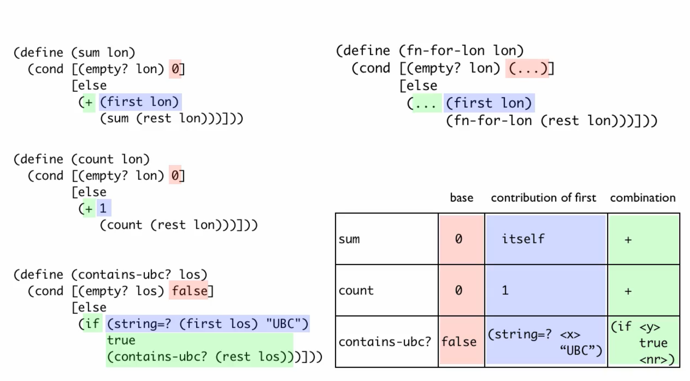

# Module 4a:

## Lists

Can have elements of different types, but not using that in the course.

```java
empty
(cons (square 10 "solid" "blue")
      (cons (triangle 20 "solid" "green") empty))
(define L1 (cons 10 (cons 9 (cons 10 empty))))

(first L1)
(rest L1)
(empty? empty)
(empty? L1)

```

Lists are a compound data: cons is a two-argument constructor and first and rest are selectors.

Type comment for a self-reference:
- ListOfString is one of:
  - 'empty
  - (cons String ListOfStrings)

## Functions on lists

```racket
;Template:
(define (fn-for-los los)
  (cond [(empty? los) (... los)]
        [else
         (... (first los) ;; String
              (rest los))]))  ;; ListOfStrings

;; Templates used:
; - one of => cond with as many [Q A] pars as options
; - atomic distinct: empty
; - compound data: (cons String ListOfString)
; - self-reference: (rest lon) is ListOfNumber
```
To write the body of a function look at intuition, purpose and examples

## Self reference

### Discussion topic
Q: The self-reference in the ListOfNatural type comment means that the type describes arbitrary-sized data. The list can have 0 elements, 1, 2 … any number. The idea that something can refer to itself may be surprising to you. Have you seen anything like self reference before?

Answers: Fractals, Matroshkas, post-modern art, soup box (woman, holding can of soup, with woman, holding can, etc), sets

### Self-reference type

When we see arbitrary-sized data => self-referenced data Type.

__Well formed__ self-referenced type :
- at least one base case
- at least one self-reference case

Examples: base case & self-ref-case

Template: call function recursively when we see self-reference in the type comment of data template.

=> Template rule: self-reference: (rest los) is ListOfStrings

__Natural recursion__: corresponds to self-reference in data type.

Base case examples/tests first: they r simple, non-base cases rely on them: will debug base case first.

Also test for lists of enough length.


06-11-2019
## Preview of function abstractions


Can think of fns operating on lists in terms of 3 components:
- base case result
- contribution of the first to the result
- how the base case result and natural recursion result are combined

```racket
(define (fn-template lon)
  (cond [(empty? lon) (<BASE>)]
        [else
         (<COMBINATION> <CONTRIBUTION_OF_FIRST>
              (fn-template (rest lon)))]))
```

## Problems

Compare my solution to a better one:

```racket
;; Design a function that consumes a list of numbers and produces the largest number
in the list.

;; my version:
#;
(define (largest lon)
  (cond [(empty? lon) 0]
        [(= (length lon) 1) (first lon)]
        [(= (length lon) 2) (max (first lon) (first (rest lon)))]
        [else (if (> (first lon) (first (rest lon)))

              (largest (cons (first lon) (rest (rest lon))))
              (largest (rest lon)))]
))

;; better ver from solution, which only works for lists with non-negative numbers:

(define (largest lon)
  (cond [(empty? lon) 0]
        [else
         (if (> (first lon) (largest (rest lon)))
             (first lon)
             (largest (rest lon)))]))

```
