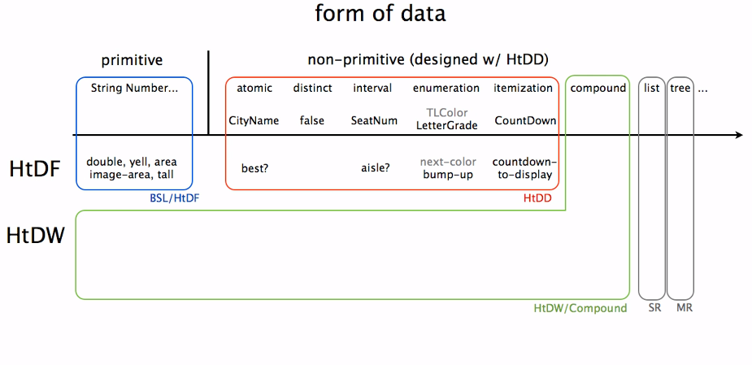

# How To Code: Simple Data, Design Recepies

## BSL Syntax

```lisp

(string-append "Ada" " " "Lovelace")
(sqrt (+ (sqr 3) (sqr 4)))


(require 2htdp/image)

(circle 10 "solid" "red")
(rectangle 30 60 "outline" "blue")
(text "HI" 24 "orange")


(overlay (circle 10 "solid" "red")
       (circle 20 "solid" "yellow")
       (circle 30 "solid" "green"))


(define WIDTH 400)
```
(define OWL  )

```lisp
(define ROWL (rotate -10 OWL))
ROWL


(or false false true)
(>= WIDTH HEIGHT)
(= 1 2)
(string=? "foo" "bar")


(if (< (image-width I1)
       (image-height I1))
    "tall"
    "wide")


(define (bulb c)
(circle 40 "solid" c))    

(bulb (string-append "purp" "le"))


(define (sign x)
  (cond [(< x 0) "-"]
        [(> x 0) "+"]
        [else "0"]))

(sign -3)
```

## Function Design recipe

#### 1. Signature
  - Type -> Type
  - as specific as possible

#### 2. Purpose
  - Produces in terms of what it consumes, one line
  - Should mention how it'll treat ambiguous cases

#### 3. Stub
  - Correct name, number of params, produces some stub correct result

#### 4. Test / Examples
  - Enough number of tests to cover all situations := to have __complete code coverage__ (can check visually in dr.Racket: it highlights code pieces that did not run)
  - Cover corner cases
  - Run and fail test to check they r correct
```java
(check-expect (double 3) 6)
```

#### 5. Template
  - (outline of a body) & constants

#### 6. Code body
#### 7. Test & Debug

## Data design Recipe

##### 0. identify the inherent structure of the information.
##### 1. A possible structure definition (not until compound data)
##### 2. A type comment
type name + how to form data of that type.
##### 3. An interpretation
describes the correspondence between information and data.
##### 4. One or more examples of the data.
##### 5. A template
for a 1 argument function operating on data of this type.


#### Data definition:
1. Represents information from Problem Domain as program data and backwards: interprets data of this type as information => __establishes correspondence between information and data__;
2. Provides a template for operating on data;
3. Shows how to form data of a new type.

#### Data definition simplifies function definition:
- restricts data consumed & produced
- helps generate examples
- provides template




## Structure of Information Flows Through


Program design is a Cross-product of data definition and function design.


Identifying the structure of information is a key step in program Design:
Structure: information -> data -> template -> function, tests

Choice in structure of the data -> function
Data driven approach. Another one (not in the How To code 2 parts) is where the control structure is dominant => blend templates based on control structure together with template based on type comments or templates based on form of data to produce the structure of the program.
